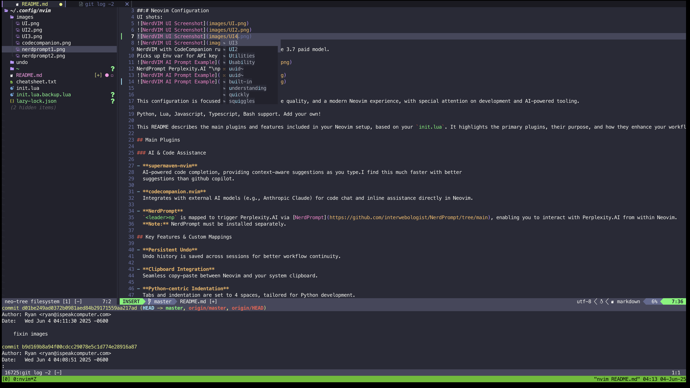
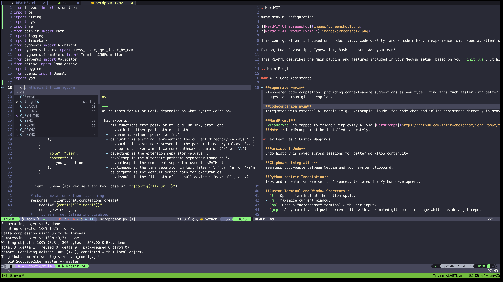
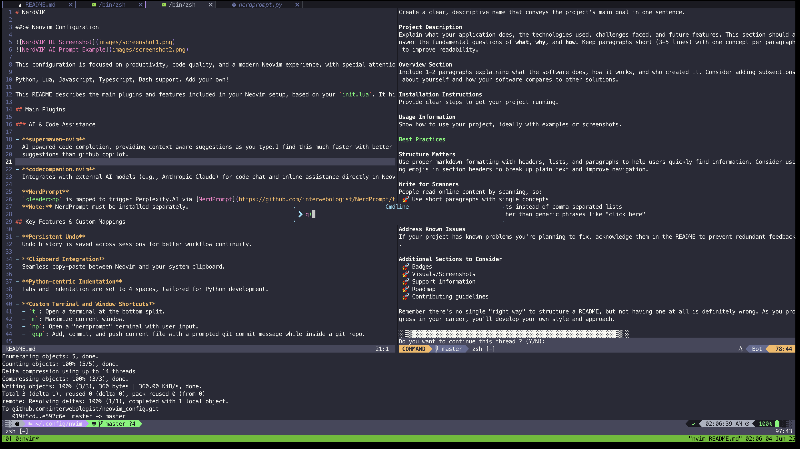
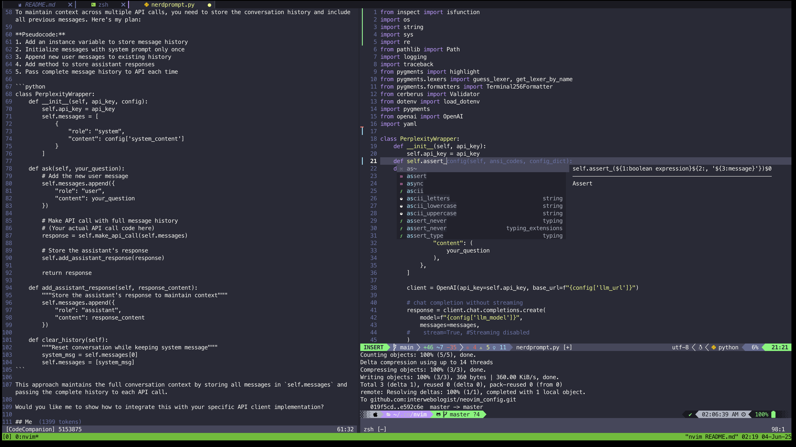
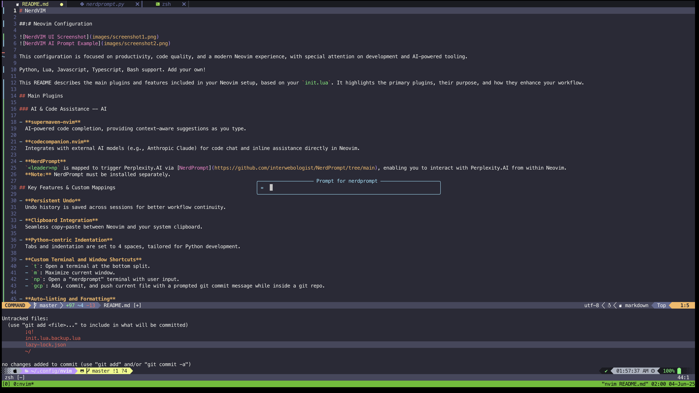
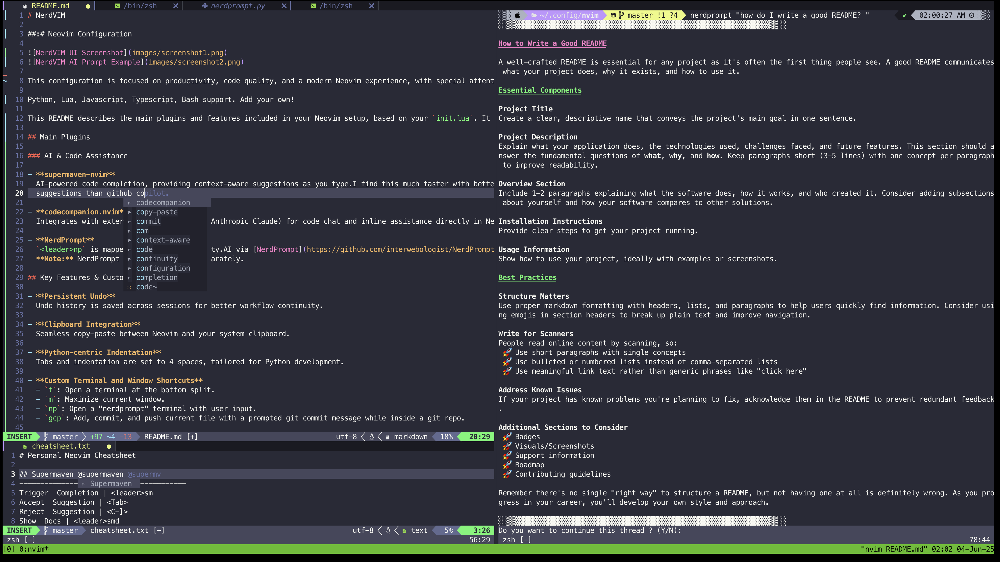

# NerdVIM

### Neovim Configuration
UI shots:

NerdVIM with CodeCompanion running Anthropic Claude 3.7 paid model.
Picks up Env var for API key automatically. 

NerdPrompt Perplexity.AI "\np" leader hotkey.

 

This configuration is focused on productivity, code quality, and a modern Neovim experience, with special attention on development and AI-powered tooling.

Python, Lua, Javascript, Typescript, Bash support. Add your own!

This README describes the main plugins and features included in your Neovim setup, based on your `init.lua`. It highlights the primary plugins, their purpose, and how they enhance your workflow.

## Main Plugins

### AI & Code Assistance 

- **supermaven-nvim**  
  AI-powered code completion, providing context-aware suggestions as you type.I find this much faster with better 
  suggestions than github copilot.

- **codecompanion.nvim**  
  Integrates with external AI models (e.g., Anthropic Claude) for code chat and inline assistance directly in Neovim.

- **NerdPrompt**  
  `<leader>np` is mapped to trigger Perplexity.AI via [NerdPrompt](https://github.com/interwebologist/NerdPrompt/tree/main), enabling you to interact with Perplexity.AI from within Neovim.  
  **Note:** NerdPrompt must be installed separately.

## Key Features & Custom Mappings
- **Mini and Rest Break Timers**
  Get reminders to take a microbreak and a restbreak. Disable the timers in the config file at the top of init.lua if not needed

- **Persistent Undo**  
  Undo history is saved across sessions for better workflow continuity.

- **Clipboard Integration**  
  Seamless copy-paste between Neovim and your system clipboard.

- **Python-centric Indentation**  
  Tabs and indentation are set to 4 spaces, tailored for Python development.

- **Custom Terminal and Window Shortcuts**  
  - `t`: Open a terminal at the bottom split.
  - `m`: Maximize current window.
  - `np`: Open a "nerdprompt" terminal with user input.
  - `gcp`: Add, commit, and push current file with a prompted git commit message while inside a git repo.

- **Auto-linting and Formatting**  
  Linting and formatting are triggered automatically on file save and buffer enter.

- **Command Cheatsheet**  
  Press `?` to open your custom cheatsheet for quick reference.

## Theme

- **Dracula** is the default color scheme, providing a dark, vibrant look.

### UI & Usability

- **cheatsheet.nvim**  
  Provides an in-editor "\?" custom command cheatsheet, allowing you to quickly reference and edit custom commands. Just the ones you add to cheatsheet.txt.

- **noice.nvim**  
  Enhances command-line and message UI with popups and a centered command palette for better visibility.

- **lualine.nvim**  
  A fast and customizable statusline, displaying useful information at the bottom of the editor.

- **barbar.nvim**  
  Offers a modern tabline for buffer management, making it easy to switch between open files.

- **neo-tree.nvim**  
  File explorer sidebar for navigating and managing the project tree visually.

- **diagflow.nvim**  
  Displays diagnostics (like LSP, Lint errors and warnings when you hover over squiggles) at the top of the window, right-aligned, for immediate feedback while coding.

### LSP, Completion, and Code Intelligence

- **nvim-lspconfig**  
  Simplifies configuring built-in LSP (Language Server Protocol) support for multiple languages, including Python, Lua, Bash, and JavaScript/TypeScript.

- **mason.nvim**  
  Manages external tools (LSP servers, linters, formatters, DAPs) with automatic installation support.

- **nvim-treesitter**  
  Advanced syntax highlighting and code parsing for better code understanding and manipulation.

- **none-ls.nvim**  
  Allows integrating external tools (like linters and formatters) as sources for LSP features.

- **nvim-lint**  
  Asynchronous linting engine, automatically runs linters (like pylint, luacheck, eslint) on save and buffer enter.

- **conform.nvim**  
  Handles code formatting, with support for format-on-save and fallback to LSP formatting.

- **blink.cmp**  
  Modern and fast autocompletion engine, supporting multiple sources (LSP, snippets, buffer, path) and customizable key mappings.

### Utilities

- **telescope.nvim**  
  (As a dependency) Powerful fuzzy finder for files, buffers, and more.

- **friendly-snippets**  
  (As a dependency) Collection of community-driven code snippets for use with completion engines.

---
